# 🚀 HandBrake2Resilio Clean Deployment Guide

## 🎯 Senior DevOps Engineering Approach

This deployment system follows enterprise-grade practices to ensure **reliable, reproducible deployments** and prevent the container staleness issues that were previously encountered.

## 📋 Files Overview

| File                              | Purpose                                              |
| --------------------------------- | ---------------------------------------------------- |
| `.cursor-rules`                   | Cursor AI rules enforcing clean deployment practices |
| `deploy_clean.sh`                 | Main deployment script with complete cleanup         |
| `verify_clean_deployment.sh`      | Comprehensive verification script                    |
| `rollback_deployment.sh`          | Emergency rollback to working state                  |
| `handbrake2resilio/.dockerignore` | Prevents unnecessary files in build context          |

## 🚨 The Golden Rule

**"When in doubt, nuke it and rebuild from scratch"**

This approach ensures:

- ✅ No stale containers
- ✅ No cached build issues
- ✅ No port conflicts
- ✅ No version mismatches
- ✅ Reproducible deployments

## 🛠️ Usage

### 1. Clean Deployment (Recommended)

```bash
# Navigate to deployment directory
cd handbrake2resilio/deployment/

# Deploy with complete cleanup
./deploy_clean.sh
```

This script will:

1. Stop and remove ALL containers
2. Remove ALL Docker images
3. Clean Docker system cache
4. Remove all build files from server
5. Kill lingering processes
6. Upload fresh code
7. Build new images with `--no-cache`
8. Start containers
9. Verify deployment

### 2. Verify Deployment

```bash
# Run comprehensive verification
./verify_clean_deployment.sh
```

This will test:

- Container health
- HTTP endpoints
- API functionality
- WebSocket connectivity
- External access
- Error logs
- Resource usage

### 3. Emergency Rollback

```bash
# If deployment fails, rollback immediately
./rollback_deployment.sh
```

This provides:

- Emergency static frontend
- Basic tab management
- API connectivity test
- Minimal working state

## 🔄 Deployment Process Flow

```mermaid
graph TD
    A[Start Deployment] --> B[Stop All Containers]
    B --> C[Remove All Images]
    C --> D[Clean Docker System]
    D --> E[Clean Server Files]
    E --> F[Kill Lingering Processes]
    F --> G[Upload Fresh Code]
    G --> H[Build Images --no-cache]
    H --> I[Start Containers]
    I --> J[Wait for Startup]
    J --> K[Verify Health]
    K --> L{All Tests Pass?}
    L -->|Yes| M[✅ Success]
    L -->|No| N[❌ Show Logs & Fail]
    N --> O[Run Rollback]
```



## 🎨 Frontend Deployment Notes

### React Build Process

- Uses multi-stage Docker build
- Node.js 18 Alpine for build stage
- Nginx Alpine for serving
- Tailwind CSS compilation
- Icon compatibility checks

### Common Issues Fixed

- **Memory icon**: Replaced with Database icon for lucide-react compatibility
- **Build cache**: Always uses `--no-cache` for clean builds
- **Dependencies**: npm install runs fresh every time
- **Environment variables**: Properly injected at runtime

## 🔧 API Gateway Deployment Notes

### Python Flask Application

- Flask-SocketIO for WebSocket support
- SQLite database for persistence
- Structured logging with timestamps
- Health check endpoint
- Tab management API

### Deployment Features

- Volume mounts for logs and data persistence
- Environment variable configuration
- Restart policies for reliability
- Resource limits for stability

## 📊 Verification Checklist

The verification script checks:

- [ ] **Container Status**: All containers running
- [ ] **HTTP Health**: All endpoints return 200
- [ ] **API Functionality**: Tab creation works
- [ ] **WebSocket**: Real-time connections active
- [ ] **External Access**: Accessible from outside
- [ ] **Error Logs**: No critical errors
- [ ] **Resource Usage**: Within normal limits
- [ ] **Clean State**: No leftover files

## 🚨 Troubleshooting

### If Deployment Fails

1. **Check container logs**:

   ```bash
   ssh akun@192.168.10.18 "docker logs handbrake2resilio-api-gateway"
   ssh akun@192.168.10.18 "docker logs handbrake2resilio-frontend"
   ```

2. **Check container status**:

   ```bash
   ssh akun@192.168.10.18 "docker ps -a"
   ```

3. **Run verification**:

   ```bash
   ./verify_clean_deployment.sh
   ```

4. **Emergency rollback**:
   ```bash
   ./rollback_deployment.sh
   ```

### Common Issues

| Issue                 | Cause                 | Solution                            |
| --------------------- | --------------------- | ----------------------------------- |
| Container won't start | Port conflict         | Run clean deployment                |
| 404 errors            | Old container running | Kill processes, redeploy            |
| Build failures        | Dependency issues     | Check package.json/requirements.txt |
| WebSocket errors      | CORS/path issues      | Verify environment variables        |

## 🔐 Security Considerations

- **No secrets in code**: Use environment variables
- **Clean filesystem**: Remove build artifacts after deployment
- **Container isolation**: Use security options
- **Minimal privileges**: Run as non-root when possible
- **Network security**: Proper CORS configuration

## 📈 Performance Optimization

- **Multi-stage builds**: Smaller final images
- **Build cache**: Disabled for production reliability
- **Resource limits**: Prevent resource exhaustion
- **Health checks**: Quick failure detection
- **Restart policies**: Automatic recovery

## 🎛️ Environment Configuration

### Development

- Can use incremental updates
- Docker cache enabled
- Hot reloading for development

### Production (192.168.10.18)

- **MUST** use clean deployment
- No Docker cache
- Full verification required
- Rollback plan ready

## 🔄 Maintenance

### Regular Tasks

- Monitor disk space on server
- Clean up old Docker images periodically
- Review container logs for errors
- Update dependencies regularly
- Test rollback procedures

### Weekly Checks

```bash
# Check disk usage
ssh akun@192.168.10.18 "df -h"

# Clean unused Docker resources
ssh akun@192.168.10.18 "docker system prune -f"

# Verify backup procedures
./verify_clean_deployment.sh
```

## 🎯 Success Metrics

A successful deployment should achieve:

- **100% test pass rate** in verification
- **< 30 second startup time** for both containers
- **Zero critical errors** in logs
- **All endpoints responding** within 2 seconds
- **External accessibility** confirmed

## 📞 Support

If issues persist:

1. Check this README
2. Review `.cursor-rules` for best practices
3. Run verification script for detailed diagnostics
4. Use rollback script for emergency recovery
5. Check container logs for specific error messages

---

**Remember**: Reliability > Speed. A 5-minute clean rebuild is better than hours debugging deployment issues.
